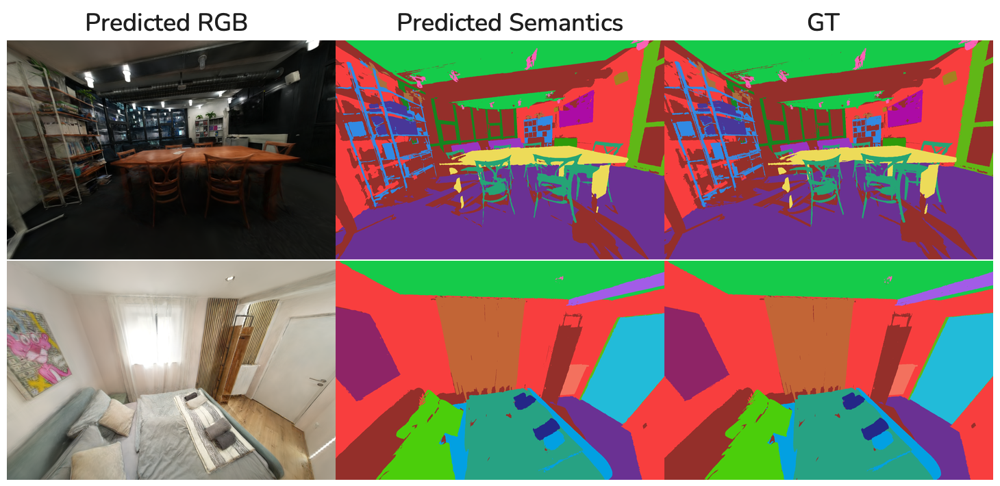

# Gaussian Semantics: Lifting 2D Semantics to 3D

**Advanced Deep Learning for Computer Vision (ADL4CV) Project**

*Noora Andreev-Ahmed, Damla Konur*

---

## Overview

This project extends 3D Gaussian Splatting (3DGS) with joint RGB and semantic optimization to lift 2D semantic predictions into view-consistent 3D representations. We use 2D segmentation masks as render-space supervision to learn per-Gaussian semantic logits alongside geometry, enabling semantic reconstruction from posed RGB images.



**Key Features:**
- Joint optimization of appearance, geometry, and per-Gaussian semantic labels
- View-consistent 3D semantics from temporally inconsistent 2D supervision
- Softmax-based probabilistic modeling and entropy regularization for complex scenes
- Evaluation on ScanNet++ with both ground-truth and noisy pseudo-labels

**Documentation:**
- 📄 **Report**: [docs/Gaussian_Semantics-Report.pdf](docs/Gaussian_Semantics-Report.pdf)
- 📊 **Poster**: [docs/Gaussian_Semantics_Damla_Konur.pdf](docs/Gaussian_Semantics_Damla_Konur.pdf)

---

## Environment Setup

### 1. Clone with submodules
```bash
git clone https://github.com/damlakonur/sem3dgs.git --recursive
cd sem3dgs
```

If already cloned without `--recursive`:
```bash
git submodule update --init --recursive
```

### 2. Create conda environment
```bash
conda env create -f environment.yml
conda activate sem3dgs
```

### 3. Install CUDA extensions
```bash
conda run -n sem3dgs bash -c "export CUDA_HOME=\$CONDA_PREFIX && pip install gaussian-splatting-seg/submodules/diff-gaussian-rasterization gaussian-splatting-seg/submodules/simple-knn"
```

---

## Usage

### Joint Training (RGB + Semantic) on ScanNet++

```bash
conda activate sem3dgs
cd gaussian-splatting-seg

python train_joint_scannet.py \
    --data_root /path/to/scannetpp/data \
    --scene_id SCENE_ID \
    --output_root ./output/scannetpp_joint \
    --image_subdir resized_undistorted_images_4x \
    --mask_subdir resized_undistorted_masks_4x \
    --transform_file transforms_undistorted_4x.json \
    --seg_masks_dir /path/to/semantic_2d_output \
    --seg_masks_subdir SCENE_ID_4x \
    --palette_path /path/to/scannetpp/metadata/semantic_palette.txt \
    --colored_masks_subdir SCENE_ID \
    --semantic_remap_path /path/to/class_remap_SCENE_ID.json \
    --num_semantic_channels NUM_CLASSES \
    --iterations 30000
```

**Key Arguments:**
- `--semantic_remap_path`: Maps sparse global class indices to consecutive local indices
- `--palette_path`: Required for semantic visualization (semantic_palette.txt)
- `--colored_masks_subdir`: Optional pre-colored GT masks for faster visualization
- `--num_semantic_channels`: Must match NUM_SEMANTIC_CHANNELS in diff-gaussian-rasterization config.h
- `--entropy_weight`: Regularization weight for Gaussian semantic entropy (optional, default: 0.0)
- `--semantic_softmax`: Use LogSoftmax+NLL instead of CrossEntropy (optional)

**Example:**
```bash
python train_joint_scannet.py \
    --data_root /path/to/scannetpp/data \
    --scene_id f36e3e1e53 \
    --output_root ./output/scannetpp_joint \
    --image_subdir resized_undistorted_images_4x \
    --mask_subdir resized_undistorted_masks_4x \
    --transform_file transforms_undistorted_4x.json \
    --seg_masks_dir /path/to/semantic_2d_output \
    --seg_masks_subdir f36e3e1e53_4x \
    --palette_path /path/to/scannetpp/metadata/semantic_palette.txt \
    --colored_masks_subdir f36e3e1e53 \
    --semantic_remap_path /path/to/class_remap_SCENE_ID.json \
    --num_semantic_channels 21 \
    --iterations 30000
```

For detailed training configurations and additional options, see `gaussian-splatting-seg/README_semantic.md`.

---

## Results

Our method achieves:
- **High semantic accuracy** under ground-truth supervision (>90% mIoU on ScanNet++)
- **View-consistent 3D semantics** even with noisy 2D pseudo-labels from OneFormer
- **Preserved visual quality** (PSNR/SSIM comparable to standard 3DGS)
- **Improved performance** on complex scenes with softmax normalization and entropy regularization

See the [report](docs/Gaussian_Semantics-Report.pdf) for quantitative results and ablation studies.

---

## Requirements
- CUDA 11.6
- Python 3.7
- PyTorch 1.12.1


## Acknowledgments

This project builds upon [3D Gaussian Splatting](https://github.com/graphdeco-inria/gaussian-splatting) by Kerbl et al. and uses [ScanNet++](https://github.com/scannetpp/scannetpp) for evaluation.
